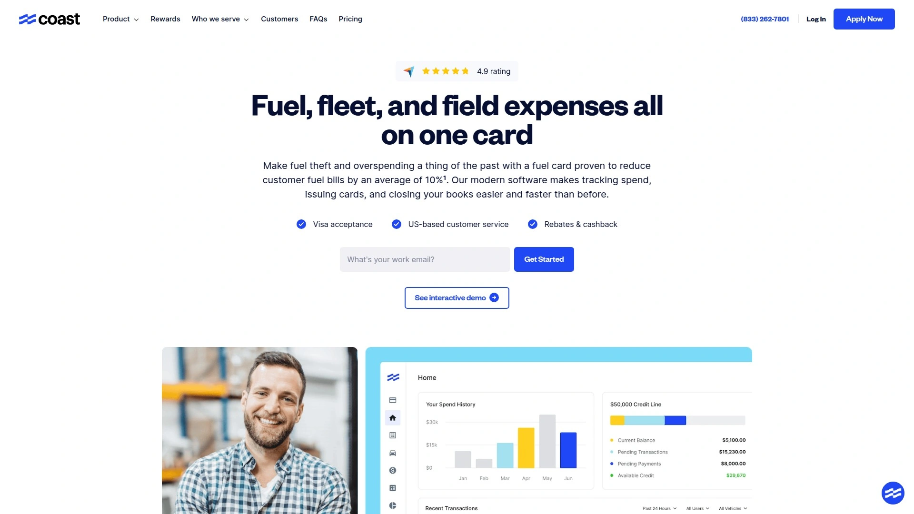
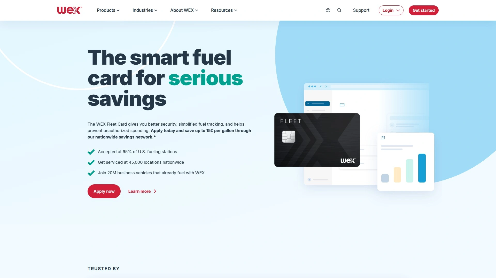
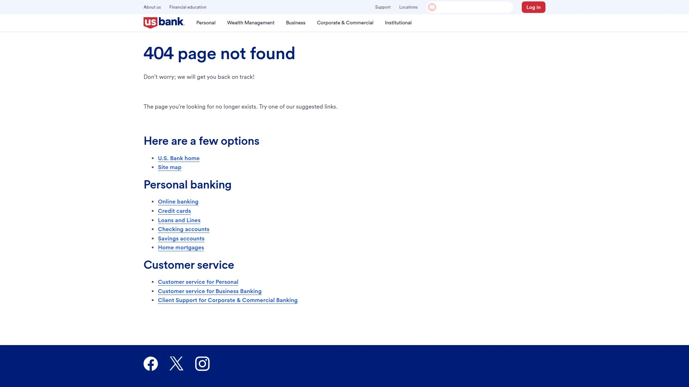
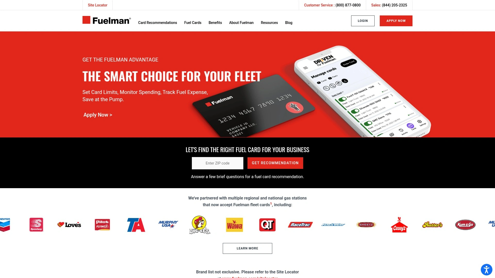
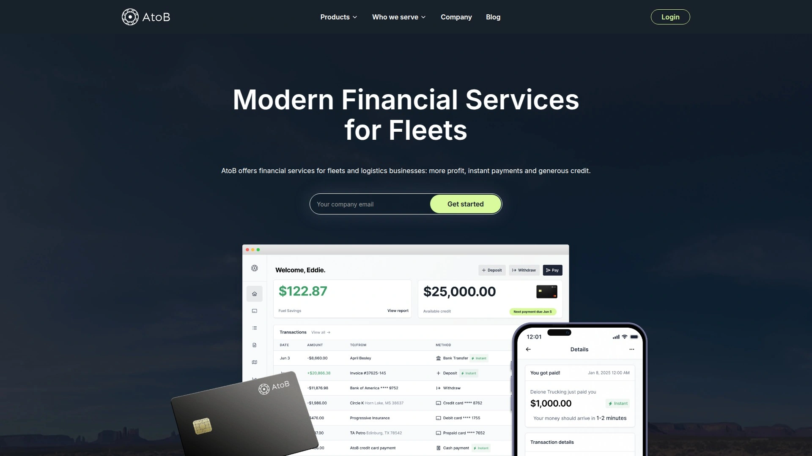
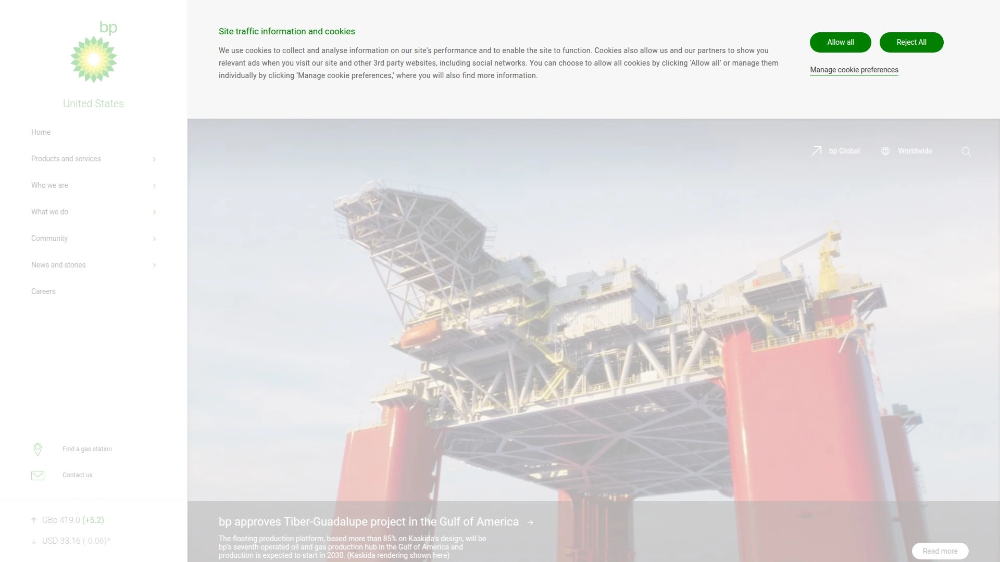
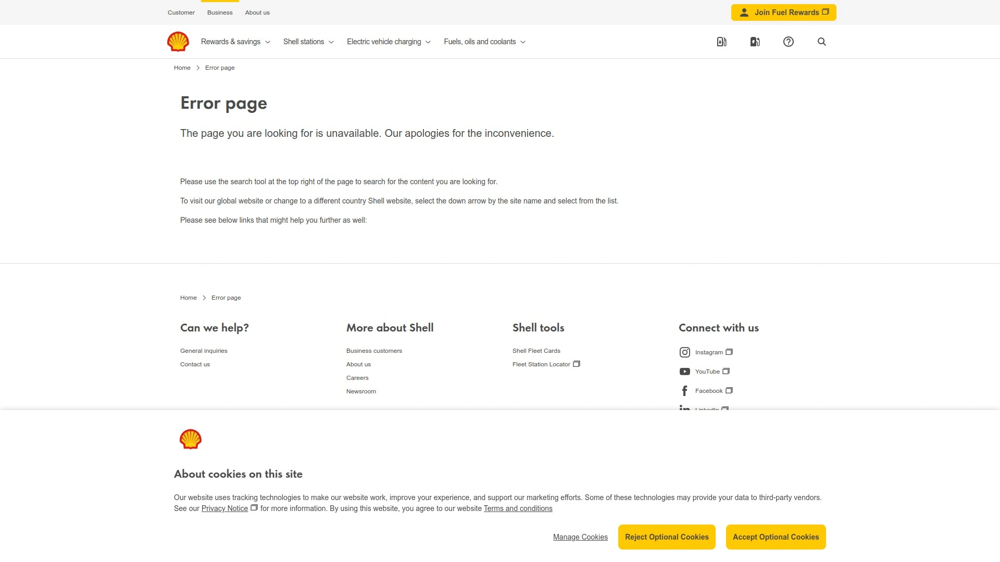

# 2025's Top 7 Best Fleet Fuel Card Tools

Managing a fleet is no small task, especially when it comes to keeping fuel costs and expenses in check. Juggling receipts, worrying about unauthorized spending, and spending hours on administrative work can pull you away from growing your business. The right fleet fuel card isn't just a payment method; it's a powerful tool for expense management that gives you control, visibility, and significant savings.

## **[Coast](https://coastpay.com)**

Fleet management and fuel card with Visa acceptance and expense controls.

Coast is a modern financial platform built for businesses with vehicle fleets, from trades to transportation. Its standout feature is the combination of a Visa-powered fleet card with an intuitive software platform that simplifies expense management. Unlike traditional fuel cards limited to specific station networks, Coast cards work anywhere Visa is accepted, giving your drivers the flexibility to find the best fuel prices. The platform provides granular control, allowing managers to set spending policies by driver or vehicle, limit purchase categories (like fuel only), and get real-time alerts on transactions to prevent misuse.

* **Core Features:** Coast offers a transparent pricing model at $4 per active user per month, with no hidden fees like per-gallon surcharges or transaction fees.
* **User Experience:** Customers praise its user-friendly interface and the ease of setting up and integrating with existing telematics and accounting software like QuickBooks and Samsara.
* **Key Advantages:** Businesses using Coast report saving an average of 9-10% on fuel and cutting down administrative work by 16 hours per month.

## **[WEX](https://www.wexinc.com)**

Widely accepted fleet fuel card with robust controls and automated accounting.

WEX is one of the most established names in the fleet industry, offering cards accepted at roughly 95% of U.S. gas stations. This massive network ensures that your drivers can almost always find a participating station nearby. The platform is designed to help businesses manage fuel spending through detailed purchase controls, real-time monitoring, and automated accounting features.

* **Applicable Scenarios:** WEX is a strong choice for fleets of all sizes that need broad network coverage and reliable expense tracking.
* **Technical Advantages:** It provides automated accounting, detailed transaction data, and a mobile app that lets managers look up driver PINs and spot potential misuse of funds.

## **[Voyager](https://www.usbank.com/business-banking/credit-cards/voyager-fuel-card.html)**

Dual-network card for fuel and on-the-road expenses with one management portal.

The Voyager fleet card, backed by U.S. Bank, offers extensive acceptance by running on both the Voyager and Mastercard networks. This allows for broad use across the U.S., Canada, and Mexico for both fuel and unexpected maintenance needs. All management happens through a single platform where you can issue cards, set spending limits, and view detailed transaction reports.

* **Differentiation:** A key benefit is its "no monthly fee" structure and a mobile app that helps drivers locate the cheapest fuel prices in their area.
* **Target Users:** Ideal for fleets that require flexibility for both fuel and non-fuel expenses and want to avoid common account fees.

## **[Fuelman](https://www.fuelman.com)**

Popular fleet fuel card with broad acceptance and tiered account options.

Fuelman offers a card accepted at over 60,000 gas stations and truck stops across the country. It is known for its multiple account tiers, which are designed to fit different fleet sizes and needs. This makes it a scalable solution as your business grows. The platform provides comprehensive spending controls and fraud protection features to secure your funds.

* **Cost Considerations:** Monthly fees vary based on the customer tier, and there may be other account fees, so it's important to choose the right plan for your fleet's needs.
* **Features:** Provides access to detailed fuel reports and a customer portal for managing cards and monitoring spending.

## **[AtoB](https://www.atob.com)**

Mastercard-based fuel card with nationwide acceptance and smart controls.

AtoB is a fintech company that provides a Mastercard-based fuel card, giving it nearly universal acceptance at gas stations across the U.S. The platform is designed for both trucking and local business fleets, combining broad network access with flexible payment options. Its biggest savings are often found at major truck stops, making it a solid option for over-the-road operations.

* **User Experience:** The platform includes a user-friendly portal and a mobile app to help drivers find the most affordable fueling locations.
* **Pricing:** AtoB offers flexible monthly pricing plans based on the number of cards, with an additional setup fee.

## **[BP](https://www.bp.com/en_us/united-states/home.html)**

Fuel card with a wide network including BP and partner stations.

The BP Fleet Card is a good option for businesses that operate near BP and Amoco gas stations. It provides tools for fuel management and helps control costs through spending limits and monitoring features. The card offers rebates on fuel purchases made within its network, which can add up to significant savings over time.

* **Core Functions:** It allows managers to track expenses by driver and vehicle, providing detailed reports to monitor fuel consumption and other costs.
* **Applicable Scenarios:** Best for fleets that can consistently fuel up at BP or its partner locations to maximize savings.

## **[Shell](https://www.shell.us/business-customers/shell-fleet-card.html)**

A comprehensive fuel card solution widely accepted across the US.

The Shell Fleet Card is accepted at over 14,000 Shell stations and participating partner locations nationwide. It's a strong solution for businesses looking for advanced reporting and fleet management capabilities. The platform allows for customized controls and purchase restrictions, giving managers tight control over how and where cards are used.

* **Features:** Offers flexible payment options and rewards programs that can help reduce overall fuel costs.
* **Target Users:** A great fit for businesses of all sizes that value the reliability of a major fuel brand and want detailed oversight of their fleet's spending.

***

### **FAQ Common Questions**

**What's the main benefit of a fleet fuel card over a regular credit card?**
Fleet cards offer detailed spending controls, like limiting purchases to fuel only or setting daily transaction limits, which standard credit cards lack. They also provide enhanced reporting that tracks spending by vehicle and driver, helping to reduce fraud and administrative time.

**Can these cards be used for expenses other than fuel?**
Yes, many modern fleet cards, including Coast and Voyager, can be configured to allow for other business-related expenses like vehicle maintenance, parking, and tolls, giving you flexible control over all on-the-road spending.

**How do these cards help prevent fuel theft?**
They offer features like real-time transaction alerts, requiring driver PINs, and setting limits on purchase times and amounts. Some platforms like Coast integrate with telematics systems to ensure the vehicle is physically at the gas station when a purchase is made, declining transactions that appear suspicious.

***

### **Conclusion**

Switching to a modern fleet fuel card can transform how you manage your business's expenses, turning a major cost center into a source of savings and efficiency. From broad acceptance networks to granular spending controls, there's a solution for every type of fleet. For businesses seeking a powerful, easy-to-use platform that combines universal Visa acceptance with transparent fees and deep expense control, [Coast](https://coastpay.com) offers a compelling solution to streamline operations and improve your bottom line.
